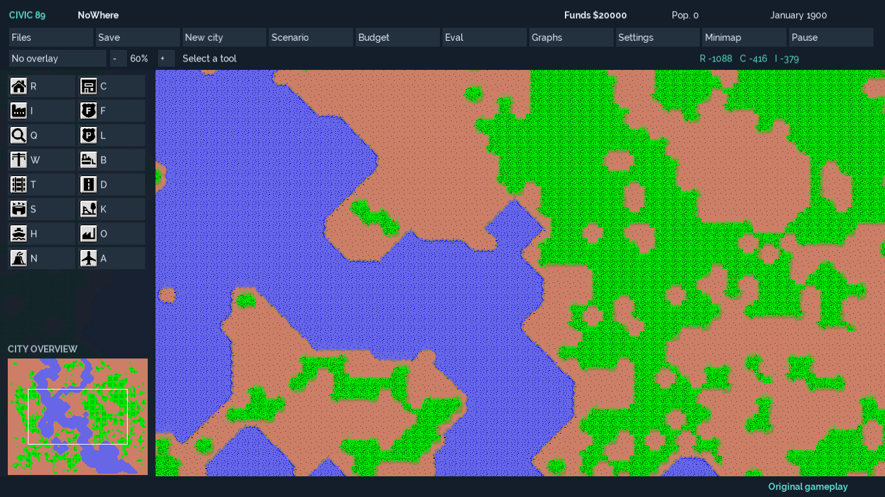

# Civic 89

A native Windows city-building game modernising the open-source Micropolis / original
SimCity simulation lineage. Civic 89 keeps the inherited simulation and adds a modern
C++20 / SDL3 desktop interface. It is an independent project, unaffiliated with EA or Maxis.



## What works

- One window with a dashboard, construction tools, minimap and budget/evaluation/history panels.
- Mouse-wheel zoom, camera panning, windowed/maximised/borderless display and DPI-aware layout.
- Traffic, crime, pollution, value, population, power and protection overlays.
- Adjustable UI scale, larger text, high contrast, configurable keys and audio volumes.
- Eight inherited scenarios, native file pickers, atomic city saves and ordinary-city autosave recovery.
- A separate SDL-free engine, headless runner and Classic simulation regression tests.
- One original-gameplay path, with `.cty` and versioned `.c89` saves and explicit import/export.

Civic 89's agreed scope is faithful original gameplay with modern Windows
presentation; gameplay expansion is outside scope. Existing M7 `.c89` identities
remain supported and use the same mechanics and map dimensions as `.cty` cities.

The next [roadmap milestones](project/engineering/08_ROADMAP_AND_IMPLEMENTATION_BACKLOG.md)
are **M8**, faithfulness/Windows polish with the simplified interface delivered on
this branch and physical desktop checks pending, and optional **M9**, improved
graphics selectable in Settings during play. M9 is planned; graphics will use the
same city and mechanics without changing saves.

## Status and compatibility

This is development software (`0.8.0-dev`), with no public release yet. Release tooling
produces portable ZIPs, per-user installers, matching source archives and checksums.
Public publication remains gated on asset rights, brand review, signing and physical
desktop acceptance. See [release instructions](project/RELEASING.md) and
[current engineering status](PROJECT_STATUS.md).

For personal testing on another PC, download the ZIP or installer from the
[draft playtest release](https://github.com/DangerMouseUK/civic89/releases)
while signed into the repository owner's/collaborator's GitHub account. Extract
the whole ZIP and double-click `civic89.exe`; developer tools are not required.
Choose x64 for Intel/AMD Windows 11 or ARM64 for ARM Windows 11. See the
[playtest instructions](packaging/DEVELOPMENT_RELEASE_NOTES.md). Draft downloads
are restricted to accounts with repository write access.

Windows 11 x64 is the primary target. Native Windows ARM64 builds, tests and packaging
also pass CI; desktop/hardware support must be validated before release. Other platforms are unsupported.

**Save compatibility:** current 51,360-byte `.cty` files and the supplied scenarios are
tested. Older 27,120-byte city files are unsupported. RNG, sprites and scenario progress
are not serialised, so loading is not an exact replay checkpoint. Automatic recovery
covers ordinary cities; explicit scenario exports reload as ordinary cities.

Classic v1 saves remain `.cty`. Enhanced v1 uses a checksummed `.c89` container that
records the ruleset and city name around the same ordinary-city snapshot. Opening
a save retains its recorded identity. F7 starts a new original-gameplay city.
The dashboard's **Files** panel offers **Open city**, **Save city**, **Import .cty copy**
and **Export .cty copy**. Import preserves the source and creates a copy saved as
`.c89`; export leaves the active city and save destination unchanged. Unknown versions and corrupt
files are rejected before replacing the current city. See the
[Classic contract](project/CLASSIC_COMPATIBILITY.md) and
[Enhanced format](project/ENHANCED_CITY_FORMAT.md). The
[faithfulness audit](project/FAITHFULNESS_AUDIT.md) records unchanged mechanics
and why historical 27,120-byte imports remain unsupported.

## Build and run

Install Visual Studio 2026 C++ tools and CMake **4.2+**. Use an external vcpkg checkout
at the manifest baseline `19780d9cdf84d0944cf9a318666703b89ab6629c`; bootstrap it with
`bootstrap-vcpkg.bat -disableMetrics`. Do not put vcpkg inside this repository.

From the repository root in PowerShell, with CMake/CTest on `PATH`:

```powershell
$env:VCPKG_ROOT = 'C:\Dev\vcpkg'
cmake --preset windows-x64-release
cmake --build --preset windows-x64-release -- /m
ctest --preset windows-x64-release --output-on-failure
./out/build/windows-x64-release/bin/Release/civic89.exe
```

Assets are staged beside the executable, and launches work from any working directory.
Dependencies and fonts are pinned; no assets are downloaded at game startup.
See [BUILDING.md](project/BUILDING.md) for Debug, ASan, ARM64, headless tools and the
retained Visual Studio comparison build.

## Controls and user data

Wheel zooms; right-drag or arrow keys pan; Home centres the camera. Space pauses,
1-4 set speed, F2 saves (Shift+F2 selects a destination), F3 opens, F4 toggles the
minimap, F5 evaluation, F6 scenarios, F7 new city, F8/F12 settings, F9 history,
F10 budget and F11 borderless fullscreen. Tab/Shift+Tab and Enter navigate panels.
Tool and command keys can be reassigned in Settings.

The status bar identifies original gameplay; Files shows the current save format.
The existing `--mode classic|enhanced` option is retained for save-format compatibility.
Both identities use the same mechanics; Classic is the default and the eight
inherited scenarios use it. New cities started through F7 use `.cty`.

Preferences, diagnostics and ordinary-city recovery live in
`%APPDATA%\Civic89\Civic89`. User-selected saves stay where you chose them.
Installer removal and portable updates preserve these files. Save As is required
after opening a city. A failed Save As retains the previous save destination.
Classic and Enhanced autosaves occupy separate slots; startup offers the newest
valid recovery and identifies its file format.

## Development and licensing

Deliver one complete [roadmap milestone](project/engineering/08_ROADMAP_AND_IMPLEMENTATION_BACKLOG.md)
per branch/PR. Preserve original gameplay and mechanics, and prove compatibility with tests.
The [scope decision](project/decisions/0009_FAITHFUL_MODERNISATION_AND_GRAPHICS.md)
records the graphics-only enhancement boundary and retained M7 save compatibility.
The exact upstream baseline and full history are preserved under `upstream-sdlpp-baseline`.

Civic 89 inherits GNU GPL v3 and the additional terms in [__README_OG](__README_OG).
Read [COPYING](COPYING), [NOTICE.md](NOTICE.md), [AUTHORS.md](AUTHORS.md) and the
[asset ledger](assets/ASSET-LICENSES.yml). Raleway remains under OFL; dependencies
have separate notices. No unlicensed retail assets or original retail sound recordings are added.

Thanks to Will Wright, Don Hopkins, Leeor Dicker and the upstream contributors.
The [original SDLPP README](project/reference/README_SDLPP.md) and
[provenance record](project/reference/UPSTREAMS.md) document the lineage.
