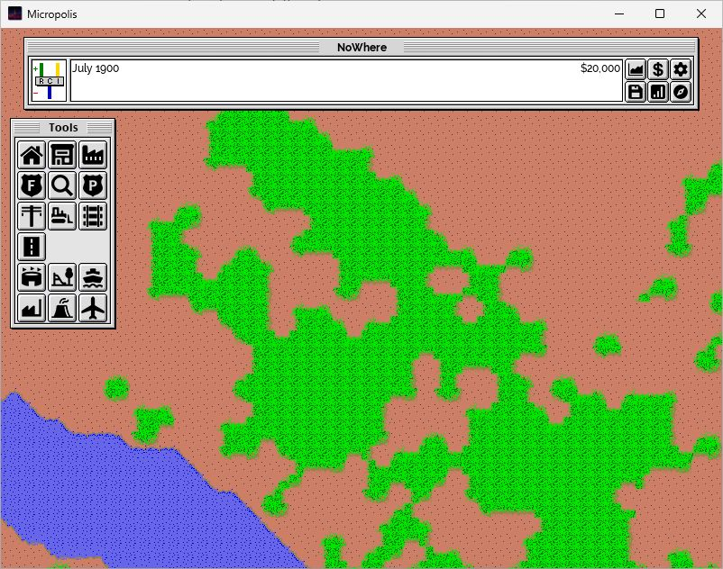

# Windows bootstrap evidence — 5 October 2026

Scope: `feature/cmake-bootstrap`, preserving SDLPP baseline `9c4e85a0decd57ba6f76d9e1ec82461940ecc3ad` and its annotated `upstream-sdlpp-baseline` tag. This records local observations, not deterministic simulation or historical file-format parity.

## Environment

Windows 11 x64; Visual Studio Enterprise 2026 18.10.3. CMake selected the installed VS 2026 BuildTools instance. Compiler MSVC 19.51.36260.0, toolset 14.51.36231, Windows SDK 10.0.26100.0, CMake/CTest 4.3.1-msvc1. C++20, dynamic x64-windows dependencies.

External vcpkg: `C:\Dev\vcpkg`, executable version `2026-09-26-51bf87ca6e9bf3e622d84ff323bd202ab1ca0c0b`, clean registry/tool checkout `19780d9cdf84d0944cf9a318666703b89ab6629c`. That registry baseline is committed in `vcpkg.json`. Five inherited direct dependencies remain unchanged; no new production dependency was added.

## Build and automated checks

Commands run in `C:\Dev\Projects\civic89` with these explicit tool locations:

```powershell
$env:VCPKG_ROOT = 'C:\Dev\vcpkg'
$cmake = 'C:\Program Files\Microsoft Visual Studio\18\Enterprise\Common7\IDE\CommonExtensions\Microsoft\CMake\CMake\bin\cmake.exe'
$ctest = 'C:\Program Files\Microsoft Visual Studio\18\Enterprise\Common7\IDE\CommonExtensions\Microsoft\CMake\CMake\bin\ctest.exe'

& 'C:\Program Files\Microsoft Visual Studio\18\Enterprise\MSBuild\Current\Bin\MSBuild.exe' micropolis-sdlpp.sln /m /p:Configuration=Release /p:Platform=x64 /verbosity:minimal /nologo /fileLogger /fileLoggerParameters:LogFile=out/audit/inherited-release-build.log

& $cmake --preset windows-x64-debug
& $cmake --build --preset windows-x64-debug -- /m
& $ctest --preset windows-x64-debug --output-on-failure

& $cmake --preset windows-x64-release
& $cmake --build --preset windows-x64-release -- /m
& $ctest --preset windows-x64-release --output-on-failure

& $cmake --install out/build/windows-x64-release --config Release --prefix out/install/windows-x64-release

# Final retained-project check after updating the manifest:
& 'C:\Program Files\Microsoft Visual Studio\18\Enterprise\MSBuild\Current\Bin\MSBuild.exe' micropolis-sdlpp.sln /m /p:Configuration=Release /p:Platform=x64 /verbosity:minimal /nologo /fileLogger /fileLoggerParameters:LogFile=out/audit/inherited-release-final-build.log
```

| Check | Result |
|---|---|
| Retained MSBuild Release x64 | Passed; 0 warnings, 0 errors at inherited `/W3` |
| Final retained MSBuild rerun | Passed after manifest change; four CS1668 environment warnings, no errors |
| CMake Debug configure/build | Passed; explicit manifest toolchain, 122 assets staged |
| CMake Release configure/build | Passed; explicit manifest toolchain, 122 assets staged |
| Debug CTest final run | 2/2 passed, 0.44 seconds |
| Release CTest final run | 2/2 passed, 0.31 seconds |
| Portable Release install | Passed; application, 11 dependency DLLs, assets and notices |
| Workflow/licence YAML | Parsed locally with PyYAML; runner, matrix, triggers, permissions and five steps checked |

CTest `runtime-assets-and-data` loads inherited JSON through `GameDataLoader`, checks 17 tool entries, road cost/name/dragging and month strings, decodes/uploads/renders 82 textures and builds all startup font atlases, including the mixed-case Windows reference. It uses SDL dummy video/software rendering and inherited `Font.cpp`. `inherited-source-list` checks the exact 47 translation units against `micropolis-cpp.vcxproj`. No production source refactor or Catch2 dependency was needed.

Both full CMake compiles exposed 50 inherited warnings at `/W4`: 40 C4100 (unused parameter), one C4189 (unused variable), two C4389 (signed comparison), one C4456 (local shadow), six C4459 (global shadow). No new test-source warnings or build errors were reported. Final incremental builds and tests passed after the staging/install changes.

The final inherited rerun reported two missing `LIB` search directories twice in Roslyn inline tasks (four CS1668 warnings): `C:\Program Files\Microsoft Visual Studio\18\Enterprise\VC\Tools\MSVC\14.51.36231\atlmfc\lib\x64` and `lib\um\x64`. This is workstation/global-integration environment evidence, not an inherited C++ compile diagnostic or Civic 89 source change. The manifest restore and application link succeeded; the environment was not repaired outside bootstrap scope.

Generated app/test/utility projects explicitly disable `VcpkgEnabled` and `VcpkgEnableManifest`; the CMake toolchain owns dependency resolution. Global integration was retained for the inherited comparison and was not uninstalled on this workstation. The subsequent fresh-source and hosted checks below extend the initial local evidence.

Git-tracked asset staging was checked independently of workstation fonts:

```powershell
git archive --format=tar --output=out/audit/committed-assets.tar HEAD assets res images icons scenarios cities COPYING __README_OG README.md project/reference/RUNTIME_ASSETS.md
New-Item -ItemType Directory -Path out/audit/fresh-tracked-assets -Force
tar -xf out/audit/committed-assets.tar -C out/audit/fresh-tracked-assets
& $cmake -DSOURCE_DIR=C:/Dev/Projects/civic89/out/audit/fresh-tracked-assets -DDESTINATION=C:/Dev/Projects/civic89/out/audit/fresh-staged-assets -P cmake/StageRuntime.cmake
```

This passed for all 122 files at asset commit `d83be2c`, including canonical Git text line endings. It proves the assets come from tracked files; it is not a fresh source compilation. Binary hashes are exact, and text hashes normalize CRLF to LF. Original RC icon/PNG inputs are separately inventoried as embedded files.

### Follow-up: fresh full-source build

After the four bootstrap commits were complete, the entire tracked tree at `9f63d86` was archived into `out/audit/fresh-source-9f63d86`, with no previous build output, ignored fonts or repository-root `vcpkg_installed` files. Both presets configured, built and passed **2/2 tests** from this copy (Debug 0.62 seconds, Release 0.46 seconds). Each fresh build reported the same 50 inherited C++ warnings and no CS1668 warnings.

The process set `VcpkgEnabled=false` and `VcpkgEnableManifest=false` to disable inherited MSBuild integration, including CMake's compiler/discovery probes; explicit CMake vcpkg manifest mode remained enabled through the presets. A property query of the generated discovery project confirmed both MSBuild properties were false. The workstation's installed integration was not changed. This is an independent tracked-source rebuild on the same workstation, not a manual second-machine test.

```powershell
git archive --format=tar --output=out/audit/fresh-source-9f63d86.tar 9f63d86
New-Item -ItemType Directory -Path out/audit/fresh-source-9f63d86
tar -xf out/audit/fresh-source-9f63d86.tar -C out/audit/fresh-source-9f63d86
$env:VCPKG_ROOT = 'C:\Dev\vcpkg'
$env:VcpkgEnabled = 'false'
$env:VcpkgEnableManifest = 'false'
Set-Location out/audit/fresh-source-9f63d86
& $cmake --preset windows-x64-debug
& $cmake --build --preset windows-x64-debug -- /m
& $ctest --preset windows-x64-debug --output-on-failure
& $cmake --preset windows-x64-release
& $cmake --build --preset windows-x64-release -- /m
& $ctest --preset windows-x64-release --output-on-failure
```

Fresh-run logs are `out/audit/fresh-windows-x64-{debug,release}-{configure,build,test}.log` in the primary working tree.

The fresh-source Release executable also rendered its generated map and exited through Alt+F4 with captured code **0**, with empty stderr. The screenshot below records this observed build at July 1900, funds 20,000; it is not a deterministic render comparison. SHA-256: `abe656da60c44b297fda6e18a7b90ed123a686b304d9dda6dcabb20a0c3cdb8a`.



### Follow-up: hosted CI

With explicit user approval, the four bootstrap commits were pushed to `origin/feature/cmake-bootstrap`. [GitHub Actions run 37317705607](https://github.com/DangerMouseUK/civic89/actions/runs/37317705607) passed at `9f63d86e3419ff727fcba6299d5cfec5ec37c0bb` on 5 October 2026. Both jobs used `windows-2025-vs2026`, MSVC 19.51.36260.0 and MSBuild 18.10.1. Each cloned vcpkg under `RUNNER_TEMP`, checked out the manifest baseline, restored dependencies and configured/built its preset through the explicit toolchain.

| Hosted job | Result | CTest time |
|---|---|---|
| `build-test (windows-x64-debug)` | Configure/build and 2/2 tests passed; 122 assets staged | 0.52 seconds |
| `build-test (windows-x64-release)` | Configure/build and 2/2 tests passed; 122 assets staged | 0.20 seconds |

These are separate hosted runner builds, extending reproducibility beyond the primary workstation. CI uses headless asset/data tests; GUI interactions were verified locally. Completed run logs were inspected with `gh run view 37317705607 --log` and saved in ignored `out/audit/hosted-ci-37317705607.log`. No hosted binary publication occurred.

## Manual GUI comparison

All runs used `Start-Process` with an explicit working directory:

```powershell
Start-Process -FilePath 'C:\Dev\Projects\civic89\x64\Release\micropolis-sdlpp.exe' -WorkingDirectory 'C:\Dev\Projects\civic89'
Start-Process -FilePath 'C:\Dev\Projects\civic89\out\build\windows-x64-release\bin\Release\civic89.exe' -WorkingDirectory 'C:\Dev\Projects\civic89\out\build\windows-x64-release\bin\Release'
Start-Process -FilePath 'C:\Dev\Projects\civic89\out\build\windows-x64-debug\bin\Debug\civic89.exe' -WorkingDirectory 'C:\Dev\Projects\civic89\out\build\windows-x64-debug\bin\Debug'
Start-Process -FilePath 'C:\Dev\Projects\civic89\out\install\windows-x64-release\civic89.exe' -WorkingDirectory 'C:\Dev\Projects\civic89\out\install\windows-x64-release'
```

| Action | Inherited Release | CMake Release |
|---|---|---|
| Startup/generated terrain/fonts/palette | Passed | Passed |
| Simulation date advance | 1901 to 1906 observed | 1902 to 1906 observed |
| Residential construction | Zone rendered, funds 20,000 to 19,900 | Zone rendered, funds 20,000 to 19,891 on trees (automatic bulldozing) |
| Minimap | Map, viewport and constructed zone rendered | Map, viewport and constructed zone rendered |
| F2 native Save As | Saved `inherited-smoke.cty` | Saved `cmake-release-smoke.cty` |
| F3 native Open and own-save reload | City title/funds/date/zone restored | City title/funds/date/zone restored |
| Alt+F4 normal exit | Process exited without error dialog | Process exited without error dialog |

The maps were generated independently; differing bulldoze cost is not a deterministic parity comparison. Debug additionally rendered a generated map, advanced to 1908 and exited with captured code **0**. Installed Release rendered a generated map, advanced from December 1900 to July 1901 and exited with captured code **0**. Their stderr logs were empty. Numeric exit codes were not captured for the first two Release GUI runs; normal exits were observed. The complete construction/minimap/save/load sequence was performed on the two Release comparison applications, not repeated on Debug/installed Release.

The checked-in fixtures in this directory are saves generated during these local GUI runs, not retail-game assets. Each is **51,360 bytes**, produced by the unchanged inherited writer. They are observation fixtures, not expected-output simulation tests:

| Fixture | SHA-256 |
|---|---|
| `inherited-smoke.cty` | `aee342bc03ddd3d28953138a42ca052e271490c3a788f04c26870513c49f2d57` |
| `cmake-release-smoke.cty` | `234d19bda258081d68698a8684a94c3bb9b3a140ec254d31429a27789499a4d6` |

## Differences and remaining gates

- New executable name/output: `out/build/windows-x64-<config>/bin/<Config>/civic89.exe`; retained comparison output: `x64/Release/micropolis-sdlpp.exe`. Relative assets/notices now stage beside the new executable; developer debugger/run working directory is explicit. Installation excludes tests, PDBs and user saves.
- Debug links matching Debug CRT/dependencies instead of the inherited project's forced Release dependency layout. Release retains `/fp:fast`, whole-program/link-time optimization and Windows subsystem. `/W4` deliberately reveals inherited warning debt.
- The missing fonts were an inherited packaging defect. Pinned, unmodified OFL Raleway files resolve it. `res/virtue.ttf` is a documented Raleway Bold alias, with different title metrics/appearance; original Virtue was excluded because its bundled EULA did not establish suitable redistribution rights. Both comparison builds use the same substitute.
- `.cty` compatibility remains an inherited question: some supplied cities are 27,120 bytes, and `FileIo.cpp` does not reject short reads. Successful current-writer round trips do not prove historical/scenario compatibility. No reader/writer or simulation changes were made.
- Existing OpenSVG icon attribution does not establish per-icon licences. Public binary redistribution and inherited embedded branding remain blocked pending rights/branding review; retained graphics/fixtures have inherited project-level provenance, not a completed individual rights audit.
- SDLPP audio/scenario/Eval stubs and resource-lifetime concerns remain unchanged. ASan, leak checks, deterministic simulation parity and historical parsing tests were not run.
- `.github/workflows/windows-ci.yml` was added after successful local build/run checks. It pins checkout, clones vcpkg outside the workspace at the manifest baseline and builds/tests both presets on `windows-2025-vs2026`. The hosted run now passes; it does not publish binaries. Runner reference: [official VS 2026 image](https://github.com/actions/runner-images/blob/main/images/windows/Windows2025-VS2026-Readme.md).
- Inherited C++ sources, solution/project, RC, GPL/additional-terms files and original README were compared unchanged against the baseline tag. No history/tag rewrite or upstream push was performed. The engineering branch was pushed to Civic 89 origin with user approval.

Ignored local evidence: `out/audit/inherited-release-build.log`, `inherited-release-final-build.log`, `cmake-{debug,release}-configure.log`, `cmake-{debug,release}-build.log`, `cmake-{debug,release}-final-build.log`, `cmake-{debug,release}-final-test.log`, `cmake-release-install.log`, `cmake-{debug,release,installed}-run.log`/`.err`. Tool commands and observed results are recorded here because those workstation logs are not committed.
