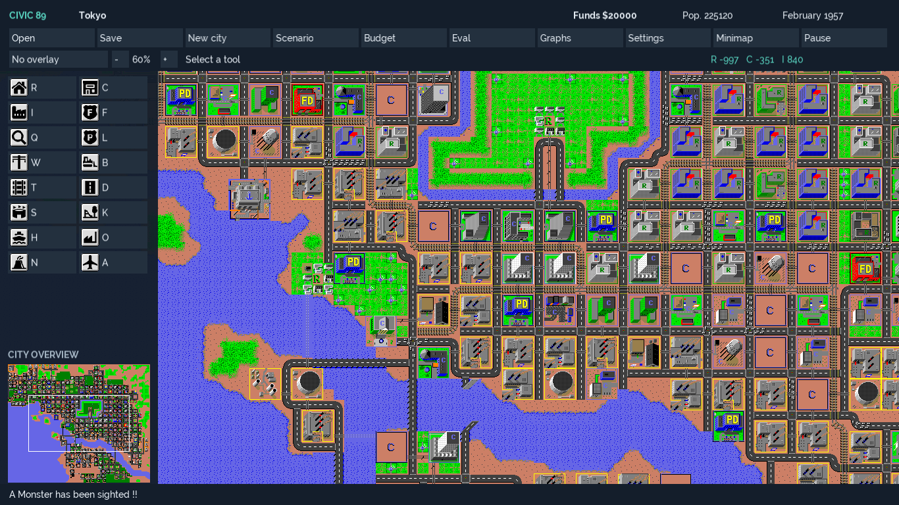
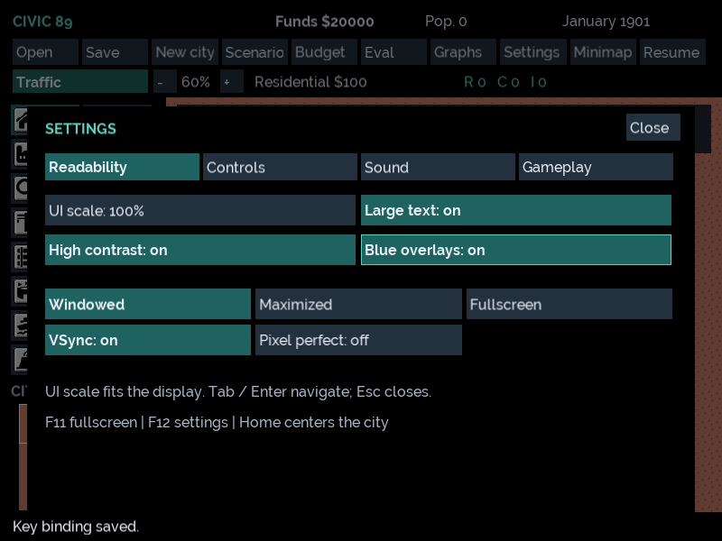
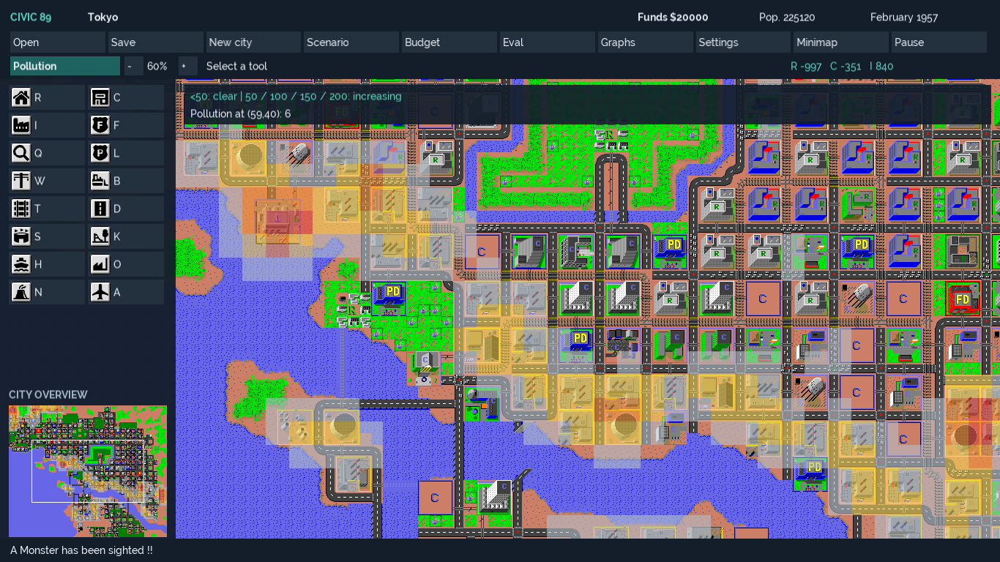

# M5 modern interface evidence — 6 October 2026

Base: user-merged M4 `fc0c4f653daa582902ef0db3d329c8e2eff06021` (PR #9).
Branch: `codex/m5-modern-ui`. Single-agent delivery of M5-01–M5-06.

## Repository synchronization

Verified PR #9 merged, fetched/pruned origin, switched to main and pulled ff-only.
Verified the M4 head is an ancestor, deleted `codex/m4-window-camera-rendering`
locally and confirmed origin had already removed it. Only main and this M5 branch
remain locally. Baseline tag still dereferences to
`9c4e85a0decd57ba6f76d9e1ec82461940ecc3ad`; upstream push remains disabled.
[M4 CI](https://github.com/DangerMouseUK/civic89/actions/runs/37466981537) passed all
four jobs on its delivered head before merge.

## Commands/results

From `C:\Dev\Projects\civic89` in PowerShell:

```powershell
$env:VCPKG_ROOT = 'C:\Dev\vcpkg'
$cmakeBin = 'C:\Program Files\Microsoft Visual Studio\18\Enterprise\Common7\IDE\CommonExtensions\Microsoft\CMake\CMake\bin'
$env:Path = "$cmakeBin;$env:Path"
foreach ($preset in @('windows-x64-debug','windows-x64-release','windows-x64-headless','windows-x64-asan','windows-x64-app-asan')) {
    cmake --preset $preset
    cmake --build --preset $preset
    ctest --preset $preset --output-on-failure
}
& 'C:\Program Files\Microsoft Visual Studio\18\Enterprise\MSBuild\Current\Bin\MSBuild.exe' micropolis-sdlpp.sln /p:Configuration=Release /p:Platform=x64 /m /verbosity:minimal /nologo
```

| Configuration | Configure/build | Full CTest | Time |
|---|---|---|---|
| Application Debug | Pass | 43/43 | 29.52 s |
| Application Release | Pass | 43/43 | 12.72 s |
| Headless Debug | Pass | 35/35 | 10.77 s |
| Headless ASan RelWithDebInfo | Pass | 35/35 | 11.73 s |
| Application ASan RelWithDebInfo | Pass | 43/43 | 27.86 s |
| Retained Visual Studio Release x64 | Pass | Not a CTest target | — |

After final input/settings refinements, rebuilt and ran:

```powershell
ctest --preset windows-x64-debug -R 'ui-overlay-preferences|milestone-lifecycle' --output-on-failure
ctest --preset windows-x64-release -R 'ui-overlay-preferences|milestone-lifecycle' --output-on-failure
ctest --preset windows-x64-app-asan -R 'ui-overlay-preferences|milestone-lifecycle' --output-on-failure
```

Each passed 2/2 (16.98 s / 6.31 s / 11.34 s). A final transport rail/power-crossing
classification refinement was rebuilt and checked with `-R ui-overlay-preferences`
in all five presets. All 25 M2 golden fixtures remain unchanged. No ASan findings.
Logs are `out/audit/m5-*`; hosted CI repeats the full four-job matrix on the PR head.
Its verified result is added to the delivered PR without another source revision.

Release/application-ASan incremental logs retain eight C4100 diagnostics each from
unchanged `WindowBase.h`/`GraphWindow.cpp` compiled for app and lifecycle targets.
No new-source warning or C++ error remains. Final inherited MSBuild passed without
warnings. Earlier historical /W4 warning inventory remains in project status.

Executables:

- `out/build/windows-x64-debug/bin/Debug/civic89.exe`
- `out/build/windows-x64-release/bin/Release/civic89.exe`
- `out/build/windows-x64-app-asan/bin/RelWithDebInfo/civic89.exe`
- retained build: `x64/Release/micropolis-sdlpp.exe`

Both application paths now instantiate the modern single-window interface. Retained
legacy panels/minimap are compiled references, not the production interface. There
are 64 common production TUs (31 engine / 33 app), three more than M4: shared overlay
model, validated preferences and modern UI. Runtime inventory remains 122 files.

## Native Windows and visual checks

From the Debug executable directory:

```powershell
$env:SDL_VIDEODRIVER = 'windows'
$env:SDL_RENDER_DRIVER = 'software' # repeat with direct3d11
$env:SDL_AUDIODRIVER = 'dummy'
.\civic89_milestone_tests.exe
```

Software and Direct3D 11 exited 0, exercising actual native display APIs, UI input,
rendering, mode/restore, graphics-reset reconstruction and twelve sessions. A final
Direct3D 11 rerun passed after UI refinements. One physical display at 100% is available;
100/125/150/200% content scale and mixed-scale input are injected, not claims of
physical monitors at each scale. The main windows are hidden and use isolated
process-specific temporary user data. User preferences/cities are not touched.

The same SDL rendering path writes PNGs through SDL_image under each application
output's `ui-captures/`. Visually reviewed compact 800x600 and wide 1366x768 captures
cover dashboard, budget, evaluation, short/long graphs, controls, sound, gameplay,
large text/high contrast, scenarios, city data and query. Initial clipped sound and
navigation captions were corrected before final verification. Representative captures:







These are renderer captures of inventoried assets, not a new runtime asset set.
Visible desktop interaction, physical mixed-DPI, assistive technologies and speaker
output remain release checks. Existing historical-city/icon-rights gates remain.

## Acceptance coverage

- `ui-overlay-preferences`: 2x2/8x8 edge addressing, partial last row, invalid
  coordinates, inherited thresholds, signed growth, power/zone/transport classification,
  accessible colors, key conflict/reserved rejection, atomic UI preference roundtrip,
  malformed/version/range/duplicate rejection. Runs with no SDL linkage.
- `milestone-lifecycle`: core UI panels across 800x600/1366x768/1920x1080/3440x1440
  and requested 100/125/150/200% scales (fit capped); Classic digest invariance;
  actual hotkeys, immediate budget setters, history toggles, configured-key conflict/
  rebinding, keyboard traversal, gameplay/volume/readability routes, retained native
  window dimensions under UI scale, minimap isolation, disabled construction and
  free debt-time Query, interrupted drag cancellation, all data layers, scenario and
  query/new-city routing, panel/overlay/minimap reconstruction, initial reverse keyboard traversal, actual animation enable/disable, twelve sessions.
- Existing camera/cadence, persistence, asset/source parity, engine boundary,
  characterization, audio and legacy bridge checks remain active.

## Compatibility

[ADR 0006](../../project/decisions/0006_M5_MODERN_INTERFACE.md) records the intentional
UI policy: all sheets suspend engine deadlines; closing preserves pause/speed, budgets
keep immediate setters, default animation remains on, and UI preferences stay outside
legacy city bytes. The Animation option now gates presentation animation. Classic
algorithms/RNG, costs, city layout, source locations, notices and golden references
are unchanged. File picker ownership moves to the application so graphics resets
retain the chosen save target. No dependency or new font/icon/sound is introduced.
