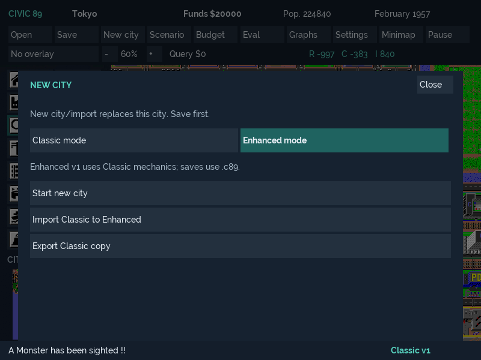
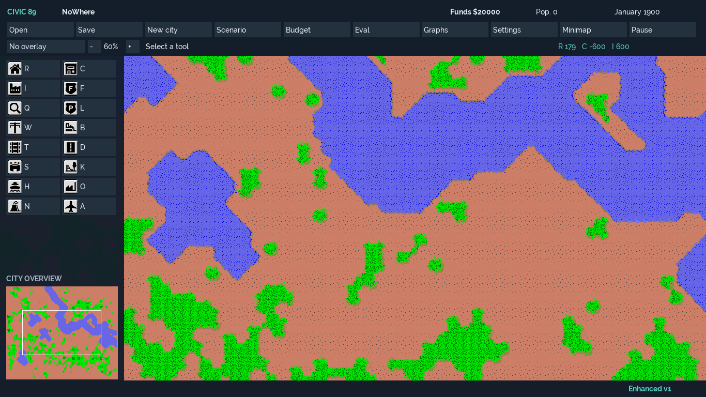

# M7 Enhanced Mode foundation evidence — 6 October 2026

Branch: `codex/m7-enhanced-foundation`. Base: merged M6 `fa3534b` (PR #11).
User-selected scope: complete Classic contract, versioned rulesets, mode selection,
save compatibility and tests. All five M7 foundation items share the branch/PR.
Larger maps and the other Enhanced gameplay candidates remain future backlog.

## Classic baseline and local acceptance

Before M7 implementation, pristine merged M6 Debug and Release runners were built
and run in separate processes with `--generate --seed 2468`:

| Phases | Debug and Release `digest_v1` |
|---:|---|
| 1,024 | `06f70d4804f2c435` |
| 16,384 | `4fadfeaabc62970d` |

The raw capture is `out/audit/m7-generated-baseline.log`. Four new CTests exercise
both Classic and Enhanced against these values. All 25 M2 golden references remain
unchanged, including the existing per-configuration Bern reference.

Windows 11 x64, CMake 4.3.1-msvc1, MSVC 19.51.36260, external vcpkg baseline
`19780d9cdf84d0944cf9a318666703b89ab6629c`. No production dependency or asset change.

```powershell
$env:VCPKG_ROOT='C:\Dev\vcpkg'
$env:Path='C:\Program Files\Microsoft Visual Studio\18\Enterprise\Common7\IDE\CommonExtensions\Microsoft\CMake\CMake\bin;' + $env:Path
cmake --preset windows-x64-debug
cmake --build --preset windows-x64-debug -- /m
ctest --preset windows-x64-debug --output-on-failure
cmake --preset windows-x64-release
cmake --build --preset windows-x64-release -- /m
ctest --preset windows-x64-release --output-on-failure
cmake --preset windows-x64-asan
cmake --build --preset windows-x64-asan -- /m
ctest --preset windows-x64-asan --output-on-failure
cmake --preset windows-x64-app-asan
cmake --build --preset windows-x64-app-asan -- /m
ctest --preset windows-x64-app-asan --output-on-failure
```

Initial local results: Debug **53/53** (31.10 s), Release **53/53** (12.61 s),
headless ASan **43/43** (19.45 s), application ASan **53/53** (28.42 s).
Compiler warnings remain in inherited implementations/headers. Native ARM64 and
complete delivery checks are recorded below when final acceptance completes.

The compatibility executable verifies known/unknown registry identities before
mutation, unchanged Classic size/layout, Unicode names/paths, Enhanced round trips
and name retention after rename, explicit import/export, histories/difficulty/funds,
incompatible save destinations, injected writes and Windows locked-replacement
failure, bounded/truncated/corrupt/unknown-version input, valid-checksum bad engine
payloads, invalid UTF-8/names, Classic scenario policy, separate recovery slots,
failed autosave preservation and fallback from a corrupt newest slot. An independent
schema-1 header/CRC reference uses Python `struct`/`zlib`: `Golden city` with a zeroed
51,360-byte payload gives 51,415 bytes and CRC `8dac66e4` (little-endian `e466ac8d`).

Retained Visual Studio Release passes with all **65** production entries (32 engine,
33 application). A running inherited executable locked the normal output during
the first attempt; the successful command uses a task-owned alternate output:

```powershell
& 'C:\Program Files\Microsoft Visual Studio\18\Enterprise\MSBuild\Current\Bin\MSBuild.exe' micropolis-sdlpp.sln /m /p:Configuration=Release /p:Platform=x64 /p:OutDir=C:\Dev\Projects\civic89\out\audit\m7-inherited\ /verbosity:minimal /nologo
```

Executable: `out/audit/m7-inherited/micropolis-sdlpp.exe`. Inherited resource and
repository-relative fallback remain available; CMake uses Civic 89 resources and
executable-relative staging. No existing process or user city was interrupted.

## Native UI acceptance

Actual SDL input chooses a pending Enhanced mode, cancels without city/mode change,
starts Enhanced and returns explicitly to Classic. All mode/import/export controls
fit at 800×600 and 1366×768. Existing M5 layout, rendering and digest checks remain.
The following native software-renderer captures were visually inspected:





## Final delivery acceptance

Final package, corresponding-source and hosted native checks are pending at this
checkpoint and will be recorded before PR handoff. Raw logs stay under ignored
`out/audit`; packages and source exports remain under ignored `out/releases`.

## Compatibility and remaining gates

No simulation algorithms, random-number calls, costs, map dimensions, financial
types or Classic byte layout change. Enhanced v1 adds explicit identity and a
bounded/checksummed container. Both modes retain inherited snapshot limits: load
scans can recompute fields; RNG/sprites/scenario objectives and transient state are
not serialized; historical 27,120-byte city files remain unsupported.

See [Classic contract](../../project/CLASSIC_COMPATIBILITY.md),
[Enhanced format](../../project/ENHANCED_CITY_FORMAT.md) and
[ADR 0008](../../project/decisions/0008_M7_ENHANCED_FOUNDATION.md).
Public asset/brand/physical desktop acceptance and trusted signing provisioning
remain gated. No public release, tag or signing identity is created by this milestone.
