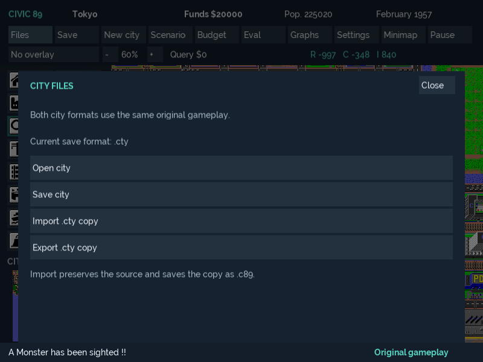

# M8 faithfulness and Windows polish evidence — 6 October 2026

Branch: `codex/m8-faithfulness-windows-polish`. Base: merged M7 `eb73f64` (PR #12).
The branch addresses all six M8 items together. Software implementation and local
checks are recorded below; required physical desktop acceptance remains pending.
M8 must not be marked fully accepted while those checks lack evidence.

## Delivered behavior and fidelity

F7 confirms one original-gameplay city, using Classic v1. Status says original
gameplay. Files offers Open/Save and explicit `.cty` import/export copies, showing
the active extension. M7 `.c89` identities, CLI options, recovery slots and current
writer/schema remain compatible; no forced conversion or retagging.

Save As selections become the current destination only after publication succeeds.
Cancellation leaves it unchanged; failure retains the prior destination and city.
Native dialogs now receive the SDL window's Win32 owner handle. Modified Enter/Esc
chords do not activate/close panel controls; focus loss cancels stale focus/binding
capture/minimap drag along with existing application gesture cancellation.

[Audit](../../project/FAITHFULNESS_AUDIT.md): 47 source/data hashes, 43 identical to
the fixed baseline and four inspected extraction/typed-presentation differences.
New regressions cover all 16 tools, budget/demand, traffic/power and rejection of
all 24 historical 27,120-byte cities before mutation. The historical format has a
different history/metadata representation; no unverified importer is introduced.
All 25 M2 goldens and four generated-city references remain unchanged. This proves
inherited SDLPP parity for covered cases, not exhaustive retail equivalence.

## Local builds and checks

Windows 11 x64; CMake 4.3.1-msvc1; MSVC 19.51.36260; external vcpkg baseline
`19780d9cdf84d0944cf9a318666703b89ab6629c`. No new production dependency or asset.

```powershell
$env:VCPKG_ROOT='C:\Dev\vcpkg'
$env:Path='C:\Program Files\Microsoft Visual Studio\18\Enterprise\Common7\IDE\CommonExtensions\Microsoft\CMake\CMake\bin;' + $env:Path
cmake --preset windows-x64-headless
cmake --build --preset windows-x64-headless -- /m
ctest --preset windows-x64-headless --output-on-failure
# Repeat configure/build/test for each of:
# windows-x64-debug, windows-x64-release, windows-x64-asan, windows-x64-app-asan
```

| Configuration | Full local result |
|---|---|
| Headless Debug | 45/45, 11.08 s |
| Application Debug | 55/55, 41.44 s |
| Application Release | 55/55, 15.48 s |
| Headless ASan | 45/45, 11.60 s |
| Application ASan | 55/55, 29.13 s |

Logs: `out/m8-headless-build.log`, `out/m8-debug-*`, `out/m8-release-*` and
`out/m8-windows-x64-*-{configure,build,test}.log`. A final explicit cast removes
the introduced NFD handle-type narrowing warning; targeted lifecycle/build reruns
are recorded in `out/m8-windows-x64-*-final-{build,test}.log`.
Inherited warnings remain; no global warning/format cleanup occurred.

Retained solution commands use a dedicated output, leaving other executables alone:

```powershell
& 'C:\Program Files\Microsoft Visual Studio\18\Enterprise\MSBuild\Current\Bin\MSBuild.exe' micropolis-sdlpp.sln /m /p:Configuration=Release /p:Platform=x64 /p:OutDir=C:\Dev\Projects\civic89\out\audit\m8-inherited\ /verbosity:minimal /nologo
```

Retained Release and the final incremental verification pass. After the narrowing
warning fix, lifecycle tests pass again in Debug (29.22 s), Release (10.18 s) and
application ASan (15.47 s). `inherited-source-list` verifies all 65 production entries (32 engine,
33 app). Executable: `out/audit/m8-inherited/micropolis-sdlpp.exe`.

## Display, input, audio and lifecycle matrix

| Check | Evidence/status |
|---|---|
| 800x600, 1366x768, 1920x1080, 2560x1440, 3440x1440, 3840x2160; requested density 100/125/150/200% | Nine panel states rendered with no panel clipping or city-digest mutation; software and native Direct3D 11 pass. |
| Compact/wide Files/New city, overlays, accessibility, settings and tool controls | Captures reviewed; real SDL event routing verifies controls and focus/keyboard behavior. |
| Native windowed/maximised/borderless APIs, resizes, renderer reset, repeated sessions | Hidden native Windows/Direct3D 11 lifecycle executable passes, exit 0. |
| Actual default audio device | `civic89_audio_tests.exe` without dummy audio opens the default device, exit 0. Audibility is not established. |
| Effects/category gains/mute/failure | Memory mixer energy checks, 12 effects, 32 lifetimes and invalid-device silent fallback pass; no simulation RNG is used for synthesis. |
| Unicode file and failed Save As | Actual app helper publishes `M8-city-城市.cty`; missing-directory and wrong-format failures preserve city, previous destination and existing bytes. Existing locked-publication/format/recovery tests pass. |
| Native file-picker cancellation/ownership/errors on visible desktop | Pending manual interaction; native owner binding added, but no observed picker run is claimed. |
| Visible Alt+Tab, minimise/restore, mouse/key navigation, readability | Pending. Desktop capture returned black pixels; focusing/closing through the computer-use bridge failed with `GetCursorPos failed: Access is denied (0x80070005)`. |
| Physical 1440p/4K/ultrawide and mixed-DPI monitors | Pending; no such physical display available to the agent. |
| Screen-reader/assistive technology | Custom SDL panels expose no Windows UI Automation control tree. Only window/titlebar controls appeared; screen-reader support is not claimed. |

Native command (working directory is the staged executable directory):

```powershell
./civic89_audio_tests.exe
$env:SDL_VIDEODRIVER='windows'
$env:SDL_RENDER_DRIVER='direct3d11'
$env:SDL_AUDIODRIVER='dummy'
./civic89_milestone_tests.exe
```

Logs: `out/m8-default-audio.log`, `out/m8-native-d3d11.log`.
Visible `civic89.exe --desktop-test` launched from an unrelated working directory,
PID 14904, selected Direct3D 11 and isolated data in
`%TEMP%\civic89-desktop-test-14904-109227484`. Its process remained responsive.
The bridge could list the window but could not interact with it. Only this owned
test process was stopped after normal UI close failed; this is not clean-quit evidence.
Twelve automated sessions provide the teardown check instead. Normal user data was
not used. Logs: `out/m8-desktop-{stdout,stderr}.log`.

These are native renderer captures, not screenshots proving physical desktop use:




## Candidate and physical checklist

For a safe local test, launch `out/build/windows-x64-release/bin/Release/civic89.exe
--desktop-test`. It starts a throwaway Detroit session with separate settings and
recovery files. Use a new test save location; native pickers still obey your choices.

1. **Look and controls:** open Budget, Files and Settings. Check that text/buttons
   fit and remain readable. Resize/maximise, press F11 twice, minimise/restore and
   switch to another app with Alt+Tab and back. Confirm clicks/keys work afterwards.
2. **Sound:** place a road and use the bulldozer. In Settings > Sound, change
   Master/Construction levels; in Gameplay toggle Sound off/on. Confirm silence
   while muted and sound returns. City effects can be checked in Tokyo's monster
   scenario. Report the speakers/headphones/device used.
3. **Dialogs and saves:** open/cancel Open and Save As (Shift+F2), including in
   fullscreen. Save a new test `.cty` with a Unicode filename, reopen it, import a
   copy, save `.c89` and export a new `.cty` copy. Confirm cancel keeps the city.
4. **Your displays:** report resolution/Windows scaling. If you already have 4K,
   ultrawide or differently scaled monitors, repeat the panels and drag the window
   between monitors. No extra hardware purchase is required; unavailable cases stay pending.
5. **Close normally:** quit with the window close button and relaunch. Report any
   crash, error, stuck input or missing file. Test data is retained under the printed
   temporary directory; this mode does not adopt normal autosaves at startup.

Record the build commit, Windows version, resolution/scaling, device and pass/fail
per item. Do not change the release gates merely because automated checks pass.
Physical recovery-prompt/clean-machine installer checks remain separate evidence.

## Delivery verification

Native ARM64 CI, complete ZIP/installer/update/rollback and corresponding-source
export verification are pending at this checkpoint. Their actual results will be
appended before the candidate is handed over. No public release/tag or trusted
signing is performed; asset/brand/signing gates remain unchanged.
